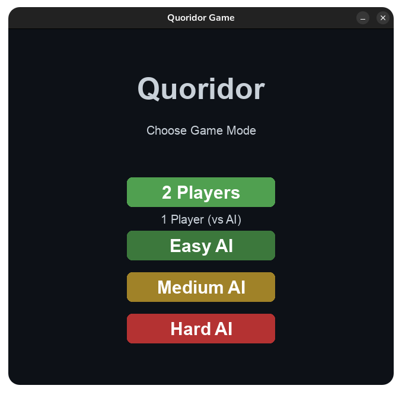
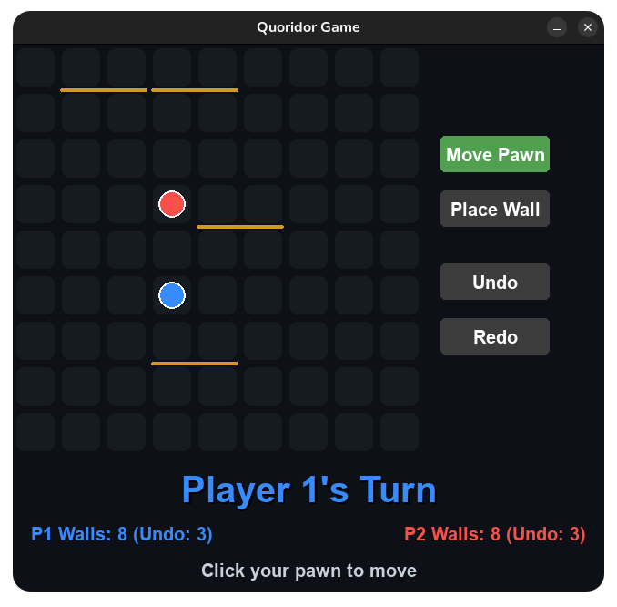
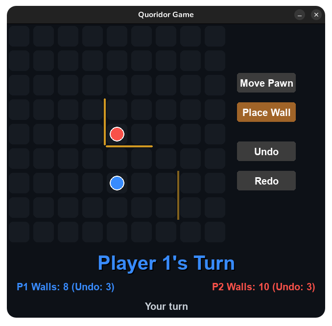
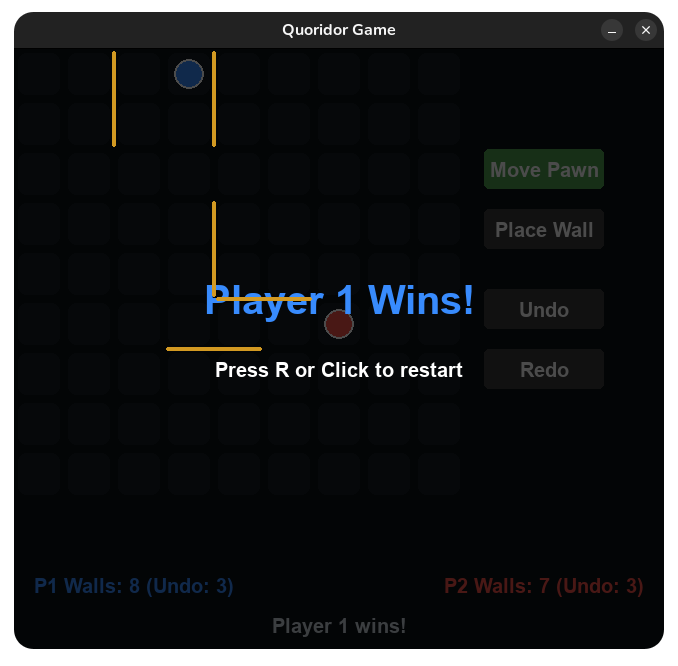

# Quoridor AI

A modern, Python-based implementation of the classic strategy board game **Quoridor**, featuring a sleek UI, local multiplayer, and a challenging AI opponent.

<p align="center">
  
  <br>
  <em>Main Menu: Mode selection with 2 Players, Easy, Medium, and Hard AI options.</em>
</p>


## Game Description

Quoridor is a fast-paced strategy game where the objective is simple: be the first player to move your pawn to any cell on the opposite side of the board. 

However, the path is never clear. On each turn, you must choose between:
1. **Moving your pawn** one square (vertically or horizontally).
2. **Placing a wall** to block your opponent's progress or create a corridor for yourself.

**The catch?** You have a limited number of walls, and you can never completely block an opponent—there must always be at least one valid path to their goal!


*Gameplay Overview: The 9x9 dark-themed board with blue and red pawns and golden walls.*


## Installation and Running

### Prerequisites
- Python 3.8 or higher
- Pygame library

### Setup
1. Clone the repository:
   ```bash
   git clone https://github.com/Adam8922/play_quoridor_versus_ai.git
   cd Quoridor
   ```

2. Install dependencies:
   ```bash
   pip install pygame
   ```

### Running the Game
Launch the game by running the main script:
```bash
python main.py
```

## Controls

The game is designed with a "Clean UI" philosophy, using a mouse-driven interface with keyboard shortcuts for quick actions.


*Wall Placement Preview: Demonstrating the translucent golden preview when hovering over a cell edge.*


### General Navigation
- **Mouse Click**: Select menu options, buttons, and board positions.
- **'R' Key**: Reset the game at any time and return to the main menu. 
- **Click to Restart**: When the game is over, you can click anywhere on the screen to return to the menu.

### Gameplay Modes
Toggle between these two modes using the buttons on the right sidebar:

1. **Move Pawn Mode (Default)**
   - Click your pawn to select it.
   - Valid moves will be highlighted in green.
   - Click a highlighted square to move your pawn.
   - *Special Move (Jump):* If your opponent is adjacent, you can jump over them!

2. **Place Wall Mode**
   - Hover your mouse near the edges between cells to see a translucent wall preview.
   - Click to place a wall.
   - Walls must span two cell lengths and cannot overlap or completely trap a player.

### Features
- **Undo/Redo**: Use the buttons on the sidebar to reverse your last move. 
  - *Note:* Each player starts with **3 Undo charges**.
- **AI Opponent**: Choose from three difficulty levels:
  - **Easy**: Makes random legal moves.
  - **Medium**: Uses basic pathfinding to reach the goal.
  - **Hard**: Employs an optimized minimax algorithm with BFS-based move ordering to provide a high challenge with fast response times.

## Project Structure
- `main.py`: Entry point of the application.
- `Board.py`: Core game engine and logic (BFS, move validation).
- `AIPlayer.py`: AI algorithms and difficulty implementations.
- `game_screen.py`: Main gameplay UI and event handling.
- `menu_screen.py`: Initial mode selection screen.
- `Constants.py`: Color palettes and board configurations.


*Victory Screen: The semi-transparent victory overlay when a player wins.*

